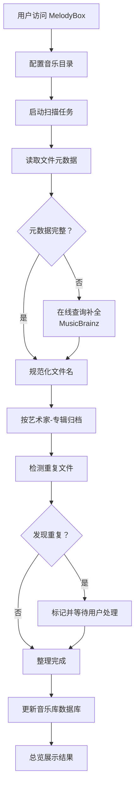
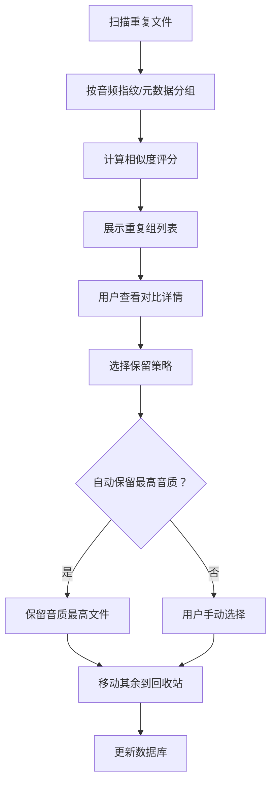

# MelodyBox (音律盒子) - 产品需求文档

## 1. 产品概述

MelodyBox 是一个面向 NAS 和内网环境的音乐文件智能整理工具，通过读取音乐元数据自动规范化文件名、去重音乐库、按"艺术家-专辑"结构归档，并提供仿 QQ 音乐主题的现代化 Web 界面。

- **核心问题**：音乐文件命名混乱、重复文件堆积、目录结构无序，难以在 NAS 上高效管理和播放
- **目标用户**：NAS 用户、音乐爱好者、个人音乐库管理者
- **核心价值**：一键整理海量音乐文件，建立标准化、可浏览的音乐资料库

---

## 2. 核心功能

### 2.1 用户角色

| 角色 | 访问方式 | 核心权限 |
|------|----------|----------|
| 管理员 | 内网直接访问 | 配置音乐目录、执行整理任务、管理重复文件 |
| 访客 | 内网直接访问 | 浏览音乐库、查看整理结果 |

### 2.2 功能模块

1. **总览仪表盘 (Dashboard)**：音乐库统计、最近整理任务、快速操作入口
2. **音乐库浏览 (Library)**：按艺术家/专辑浏览、搜索、文件详情查看
3. **整理中心 (Organize)**：文件名规范化、目录结构整理、任务进度监控
4. **去重管理 (Duplicates)**：重复文件检测、对比预览、批量清理
5. **系统设置 (Settings)**：目录配置、整理规则、命名模板自定义

### 2.3 页面详情

| 页面名称 | 模块名称 | 功能描述 |
|----------|----------|----------|
| 总览仪表盘 | 统计卡片 | 显示音乐总数、艺术家数、专辑数、重复文件数 |
| 总览仪表盘 | 最近任务 | 展示最近执行的整理任务及状态 |
| 总览仪表盘 | 快速操作 | 一键整理、扫描去重、刷新音乐库按钮 |
| 音乐库浏览 | 艺术家列表 | 按字母索引的艺术家卡片网格 |
| 音乐库浏览 | 专辑视图 | 选中艺术家后的专辑封面网格 |
| 音乐库浏览 | 歌曲列表 | 选中专辑后的歌曲详细列表 |
| 音乐库浏览 | 全局搜索 | 按歌名/艺术家/专辑实时搜索 |
| 整理中心 | 整理配置 | 命名模板设置、目录结构选择 |
| 整理中心 | 任务监控 | 实时进度条、日志输出、任务队列 |
| 整理中心 | 预览对比 | 整理前后的文件名/目录结构对比 |
| 去重管理 | 重复列表 | 按相似度分组的重复文件组 |
| 去重管理 | 文件对比 | 音质参数、文件大小、元数据对比 |
| 去重管理 | 批量操作 | 保留最高音质/最新文件、手动选择 |
| 系统设置 | 目录管理 | 配置输入/输出音乐目录、排除规则 |
| 系统设置 | 命名规则 | 自定义文件名模板变量 |
| 系统设置 | 任务配置 | 并发数、格式支持、日志级别 |

---

## 3. 核心流程

### 3.1 音乐整理主流程

用户配置音乐目录后，系统扫描所有音频文件，读取元数据（艺术家、专辑、标题、音轨号等），按自定义模板规范化文件名，并按"艺术家/专辑/歌曲"结构重新组织目录，同时检测并标记重复文件供用户处理。

### 3.2 去重处理流程

---

## 4. 用户界面设计

### 4.1 设计风格

仿 QQ 音乐主题设计，采用现代深色/浅色双主题：

- **主色调**：QQ 音乐绿 `#31C27C`（主操作、激活状态）
- **辅助色**：`#FFE8E8`（浅色背景点缀）、`#1FD1A1`（渐变延伸）
- **背景色**：
  - 浅色主题：`#F5F5F7`（主背景）、`#FFFFFF`（卡片）
  - 深色主题：`#1A1A1A`（主背景）、`#2A2A2A`（卡片）
- **文字色**：`#333333`（浅色主文）、`#FFFFFF`（深色主文）、`#999999`（次要文字）
- **按钮风格**：圆角胶囊按钮（8px 圆角），主按钮绿色渐变 `#31C27C → #1FD1A1`
- **字体**：
  - 标题：`"PingFang SC", "HarmonyOS Sans", "Microsoft YaHei"` 700 字重
  - 正文：同上 400 字重
  - 数字/计数：`"DIN Alternate", "SF Pro Display"` 等宽风格
- **布局风格**：左侧导航栏 + 右侧内容区，顶部全局搜索栏，卡片式网格布局
- **图标风格**：线性图标（Lucide React），绿色激活态
- **动效**：卡片悬浮上浮、页面切换淡入、进度条流光、按钮波纹点击

### 4.2 页面设计概览

| 页面名称 | 模块名称 | UI 元素 |
|----------|----------|--------|
| 总览仪表盘 | 统计卡片 | 4 列卡片网格、大号数字、图标、渐变背景、悬浮上浮动画 |
| 总览仪表盘 | 最近任务 | 时间轴布局、状态标签、进度条、操作日志摘要 |
| 总览仪表盘 | 快速操作 | 大号胶囊按钮组、绿色渐变、图标+文字、点击波纹 |
| 音乐库浏览 | 艺术家列表 | 响应式卡片网格（每行 5-6 个）、圆形头像、字母索引侧栏 |
| 音乐库浏览 | 专辑视图 | 方形封面网格、悬浮显示详情、播放图标叠加 |
| 音乐库浏览 | 歌曲列表 | 表格布局、音轨号、时长、格式标签、悬浮操作栏 |
| 整理中心 | 整理配置 | 表单卡片、模板输入框、变量标签、实时预览 |
| 整理中心 | 任务监控 | 大号环形进度、滚动日志面板、步骤指示器 |
| 去重管理 | 重复列表 | 分组卡片、相似度环形图、文件缩略信息 |
| 去重管理 | 文件对比 | 双栏对比表格、差异高亮、波形预览 |
| 系统设置 | 目录管理 | 路径输入框、文件夹树选择器、排除规则编辑器 |

### 4.3 响应式设计

- **桌面优先**：设计基准 1440px 宽度，适配 1280px-1920px
- **平板适配**：768px-1280px 时导航栏收起为图标，网格列数减半
- **移动端适配**：< 768px 时底部 Tab 导航，单列卡片布局
- **触控优化**：按钮最小 44px 触摸区域，支持滑动手势切换页面

---

## 5. 非功能需求

### 5.1 性能要求
- 音乐库扫描：支持 10000+ 文件批量处理
- 搜索响应：< 300ms 实时搜索
- 页面加载：首屏 < 2s（内网环境）

### 5.2 部署要求
- Docker 容器化部署，单镜像包含前后端
- 支持挂载 NAS 音乐目录到容器
- 端口配置：`28080`（Web 服务）、`28081`（API 服务，可选内部暴露）
- 数据持久化：SQLite 数据库 + 配置文件挂载卷

### 5.3 兼容性
- 音频格式：MP3、FLAC、APE、WAV、M4A、OGG、OPUS
- 浏览器：Chrome 90+、Firefox 88+、Safari 14+、Edge 90+
- NAS 平台：群晖、威联通、unRAID 等支持 Docker 的设备
