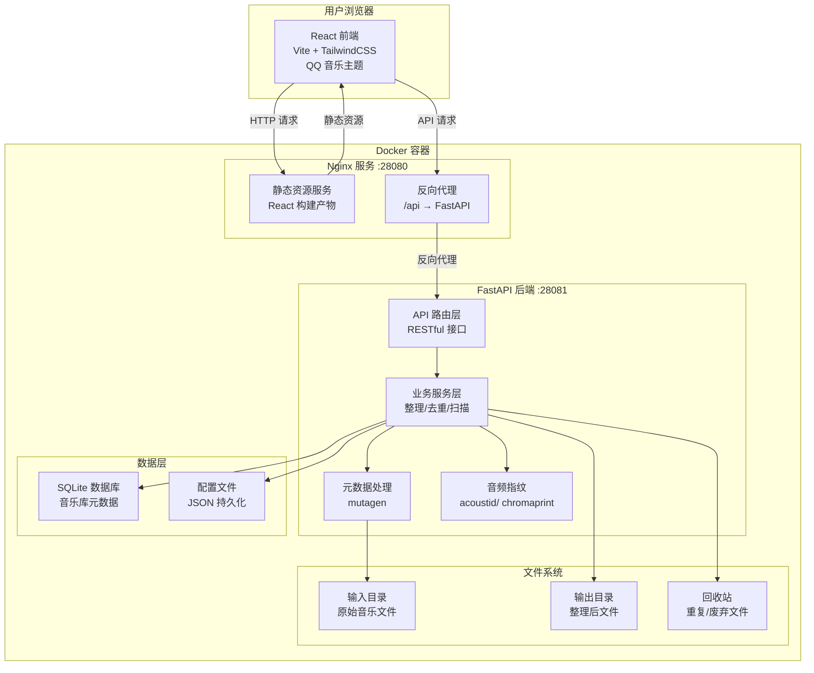
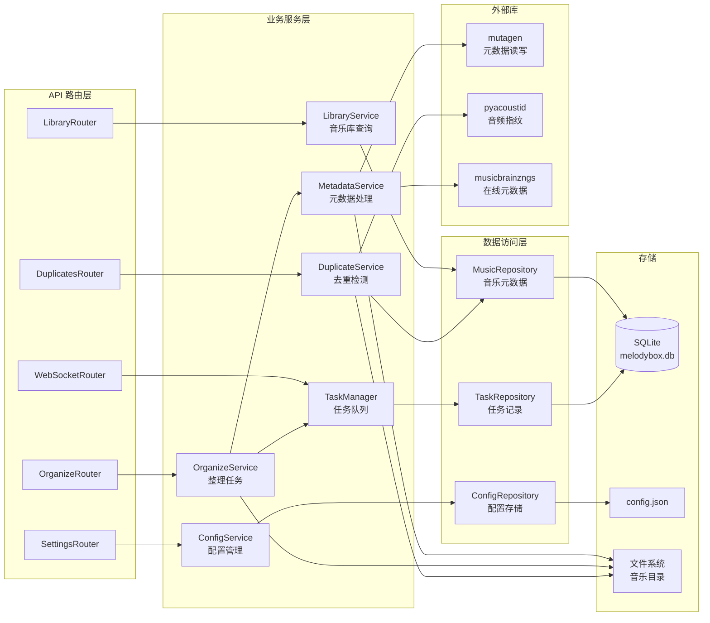
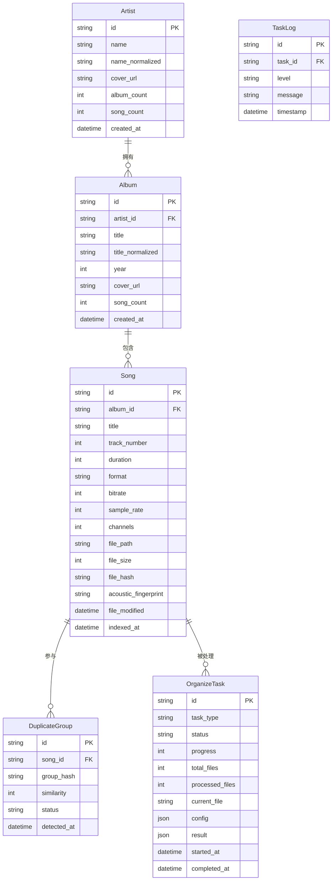

# MelodyBox (音律盒子) - 技术架构文档

## 1. 架构设计



## 2. 技术说明

- **前端**：React@18 + Vite@5 + TailwindCSS@3 + React Router@6 + Axios
- **初始化工具**：Vite (react-ts 模板)
- **后端**：Python@3.11 + FastAPI@0.104 + Uvicorn
- **音频处理**：mutagen（元数据读写）、pyacoustid（音频指纹去重）
- **在线元数据**：musicbrainzngs（MusicBrainz 在线补全）
- **数据库**：SQLite（轻量、无需额外服务、适合 NAS）
- **部署**：Docker 多阶段构建 + Nginx 反向代理
- **端口**：Web 服务 `28080`，API 内部 `28081`（不对外暴露）

## 3. 路由定义

| 路由 | 页面 | 功能说明 |
|------|------|----------|
| `/` | 总览仪表盘 | 重定向到 dashboard |
| `/dashboard` | 总览仪表盘 | 音乐库统计、快速操作 |
| `/library` | 音乐库浏览 | 艺术家→专辑→歌曲层级浏览 |
| `/library/:artistId` | 艺术详情 | 指定艺术家的专辑列表 |
| `/library/:artistId/:albumId` | 专辑详情 | 指定专辑的歌曲列表 |
| `/organize` | 整理中心 | 配置并执行整理任务 |
| `/duplicates` | 去重管理 | 重复文件检测与清理 |
| `/settings` | 系统设置 | 目录、命名规则配置 |

## 4. API 定义

### 4.1 音乐库管理 API

```typescript
// 获取音乐库统计
GET /api/library/stats
Response: {
  totalSongs: number;
  totalArtists: number;
  totalAlbums: number;
  totalDuplicates: number;
  totalSize: number;       // bytes
  formatBreakdown: { format: string; count: number }[];
}

// 获取艺术家列表
GET /api/library/artists?sortBy=name&page=1&pageSize=50
Response: {
  items: {
    id: string;
    name: string;
    albumCount: number;
    songCount: number;
    coverUrl?: string;
  }[];
  total: number;
}

// 获取专辑列表
GET /api/library/artists/:artistId/albums
Response: {
  items: {
    id: string;
    title: string;
    year?: number;
    songCount: number;
    coverUrl?: string;
  }[];
}

// 获取歌曲列表
GET /api/library/albums/:albumId/songs
Response: {
  items: {
    id: string;
    title: string;
    trackNumber: number;
    duration: number;      // seconds
    format: string;
    bitrate: number;
    sampleRate: number;
    filePath: string;
    fileSize: number;
  }[];
}

// 全局搜索
GET /api/library/search?q=keyword&type=all
Response: {
  songs: Song[];
  artists: Artist[];
  albums: Album[];
}
```

### 4.2 整理任务 API

```typescript
// 获取整理配置
GET /api/organize/config
Response: {
  inputDir: string;
  outputDir: string;
  recycleDir: string;
  namingTemplate: string;     // 例如 "{artist}/{album}/{track:02d}-{title}"
  moveInsteadOfCopy: boolean;
  overwritePolicy: "skip" | "overwrite" | "rename";
  excludePatterns: string[];
}

// 更新整理配置
PUT /api/organize/config
Body: OrganizeConfig
Response: { success: boolean }

// 预览整理结果
POST /api/organize/preview
Body: { dryRun: true }
Response: {
  changes: {
    oldPath: string;
    newPath: string;
    action: "rename" | "move" | "skip";
    reason: string;
  }[];
  totalChanges: number;
}

// 启动整理任务
POST /api/organize/start
Body: { dryRun?: boolean }
Response: { taskId: string }

// 获取任务状态
GET /api/organize/tasks/:taskId
Response: {
  id: string;
  status: "pending" | "running" | "completed" | "failed";
  progress: number;        // 0-100
  currentFile?: string;
  totalFiles: number;
  processedFiles: number;
  logs: { time: string; level: string; message: string }[];
  startedAt: string;
  completedAt?: string;
}

// 获取最近任务列表
GET /api/organize/tasks?page=1&pageSize=10
Response: { items: Task[]; total: number }

// WebSocket 实时任务进度
WS /api/ws/organize/:taskId
Message: {
  type: "progress" | "log" | "completed" | "error";
  data: TaskProgress | LogEntry;
}
```

### 4.3 去重管理 API

```typescript
// 扫描重复文件
POST /api/duplicates/scan
Response: { taskId: string }

// 获取重复组列表
GET /api/duplicates/groups?page=1&pageSize=20
Response: {
  items: {
    id: string;
    similarity: number;       // 0-100
    files: {
      id: string;
      filePath: string;
      title: string;
      artist: string;
      format: string;
      bitrate: number;
      sampleRate: number;
      fileSize: number;
      modifiedAt: string;
      recommended: boolean;   // 建议保留
    }[];
  }[];
  total: number;
}

// 处理重复组（保留指定文件，其余移入回收站）
POST /api/duplicates/groups/:groupId/resolve
Body: { keepFileId: string; action: "recycle" | "delete" }
Response: { success: boolean; recycledFiles: string[] }
```

### 4.4 系统设置 API

```typescript
// 获取系统配置
GET /api/settings
Response: {
  musicDirs: { input: string; output: string; recycle: string };
  supportedFormats: string[];
  concurrency: number;
  logLevel: "debug" | "info" | "warning" | "error";
}

// 更新系统配置
PUT /api/settings
Body: SystemSettings
Response: { success: boolean }

// 测试目录访问
POST /api/settings/test-dir
Body: { path: string }
Response: { accessible: boolean; fileCount?: number; error?: string }
```

## 5. 服务端架构图



## 6. 数据模型

### 6.1 数据模型定义



### 6.2 数据定义语言

```sql
-- 艺术家表
CREATE TABLE artists (
    id TEXT PRIMARY KEY DEFAULT (lower(hex(randomblob(16)))),
    name TEXT NOT NULL,
    name_normalized TEXT NOT NULL,
    cover_url TEXT,
    album_count INTEGER DEFAULT 0,
    song_count INTEGER DEFAULT 0,
    created_at DATETIME DEFAULT CURRENT_TIMESTAMP
);
CREATE INDEX idx_artists_name ON artists(name_normalized);

-- 专辑表
CREATE TABLE albums (
    id TEXT PRIMARY KEY DEFAULT (lower(hex(randomblob(16)))),
    artist_id TEXT NOT NULL,
    title TEXT NOT NULL,
    title_normalized TEXT NOT NULL,
    year INTEGER,
    cover_url TEXT,
    song_count INTEGER DEFAULT 0,
    created_at DATETIME DEFAULT CURRENT_TIMESTAMP,
    FOREIGN KEY (artist_id) REFERENCES artists(id) ON DELETE CASCADE
);
CREATE INDEX idx_albums_artist ON albums(artist_id);
CREATE INDEX idx_albums_title ON albums(title_normalized);

-- 歌曲表
CREATE TABLE songs (
    id TEXT PRIMARY KEY DEFAULT (lower(hex(randomblob(16)))),
    album_id TEXT NOT NULL,
    title TEXT NOT NULL,
    track_number INTEGER,
    duration INTEGER,
    format TEXT NOT NULL,
    bitrate INTEGER,
    sample_rate INTEGER,
    channels INTEGER,
    file_path TEXT NOT NULL UNIQUE,
    file_size INTEGER,
    file_hash TEXT,
    acoustic_fingerprint TEXT,
    file_modified DATETIME,
    indexed_at DATETIME DEFAULT CURRENT_TIMESTAMP,
    FOREIGN KEY (album_id) REFERENCES albums(id) ON DELETE CASCADE
);
CREATE INDEX idx_songs_album ON songs(album_id);
CREATE INDEX idx_songs_hash ON songs(file_hash);
CREATE INDEX idx_songs_fingerprint ON songs(acoustic_fingerprint);
CREATE INDEX idx_songs_format ON songs(format);

-- 重复组表
CREATE TABLE duplicate_groups (
    id TEXT PRIMARY KEY DEFAULT (lower(hex(randomblob(16)))),
    song_id TEXT NOT NULL,
    group_hash TEXT NOT NULL,
    similarity INTEGER,
    status TEXT DEFAULT 'pending',
    detected_at DATETIME DEFAULT CURRENT_TIMESTAMP,
    FOREIGN KEY (song_id) REFERENCES songs(id) ON DELETE CASCADE
);
CREATE INDEX idx_dup_groups_hash ON duplicate_groups(group_hash);
CREATE INDEX idx_dup_groups_status ON duplicate_groups(status);

-- 整理任务表
CREATE TABLE organize_tasks (
    id TEXT PRIMARY KEY DEFAULT (lower(hex(randomblob(16)))),
    task_type TEXT NOT NULL,
    status TEXT NOT NULL DEFAULT 'pending',
    progress INTEGER DEFAULT 0,
    total_files INTEGER DEFAULT 0,
    processed_files INTEGER DEFAULT 0,
    current_file TEXT,
    config TEXT,
    result TEXT,
    started_at DATETIME,
    completed_at DATETIME,
    created_at DATETIME DEFAULT CURRENT_TIMESTAMP
);
CREATE INDEX idx_tasks_status ON organize_tasks(status);

-- 任务日志表
CREATE TABLE task_logs (
    id TEXT PRIMARY KEY DEFAULT (lower(hex(randomblob(16)))),
    task_id TEXT NOT NULL,
    level TEXT NOT NULL DEFAULT 'info',
    message TEXT NOT NULL,
    timestamp DATETIME DEFAULT CURRENT_TIMESTAMP,
    FOREIGN KEY (task_id) REFERENCES organize_tasks(id) ON DELETE CASCADE
);
CREATE INDEX idx_logs_task ON task_logs(task_id);
CREATE INDEX idx_logs_time ON task_logs(timestamp);

-- 初始化默认配置
INSERT INTO organize_tasks (id, task_type, status, config) VALUES
('system_init', 'init', 'completed', '{"initialized": true}');
```

## 7. Docker 部署架构

### 7.1 多阶段构建

```dockerfile
# 阶段1：前端构建
FROM node:20-alpine AS frontend-builder
WORKDIR /app/frontend
COPY frontend/package*.json ./
RUN npm ci
COPY frontend/ ./
RUN npm run build

# 阶段2：后端依赖
FROM python:3.11-slim AS backend-deps
WORKDIR /app/backend
COPY backend/requirements.txt ./
RUN pip install --no-cache-dir -r requirements.txt

# 阶段3：生产镜像
FROM python:3.11-slim
# 安装 nginx 和 chromaprint（音频指纹）
RUN apt-get update && apt-get install -y --no-install-recommends \
    nginx libsndfile1 chromaprint-tools && \
    rm -rf /var/lib/apt/lists/*

# 复制后端
WORKDIR /app/backend
COPY --from=backend-deps /usr/local/lib/python3.11/site-packages /usr/local/lib/python3.11/site-packages
COPY backend/ ./

# 复制前端构建产物到 nginx
COPY --from=frontend-builder /app/frontend/dist /usr/share/nginx/html
COPY docker/nginx.conf /etc/nginx/conf.d/default.conf

# 启动脚本：同时运行 nginx 和 uvicorn
COPY docker/start.sh /start.sh
RUN chmod +x /start.sh

EXPOSE 28080
CMD ["/start.sh"]
```

### 7.2 docker-compose.yml

```yaml
version: "3.8"
services:
  melodybox:
    build: .
    image: melodybox:latest
    container_name: melodybox
    restart: unless-stopped
    ports:
      - "28080:28080"
    volumes:
      # 音乐目录映射（按需修改为实际 NAS 路径）
      - /path/to/music:/music:rw
      # 数据持久化
      - ./data:/app/data:rw
      # 配置文件
      - ./config:/app/config:rw
    environment:
      - TZ=Asia/Shanghai
      - MUSIC_INPUT_DIR=/music
      - MUSIC_OUTPUT_DIR=/music
      - MUSIC_RECYCLE_DIR=/music/.recycle
      - DB_PATH=/app/data/melodybox.db
      - LOG_LEVEL=info
```
```
```

### 7.3 端口规划

| 服务 | 端口 | 说明 |
|------|------|------|
| Nginx (Web + API 代理) | 28080 | 对外暴露的唯一端口 |
| FastAPI (内部) | 28081 | 容器内部，不对外暴露 |

### 7.4 GitHub 仓库结构

```
melodybox/
├── frontend/                 # React 前端
│   ├── src/
│   ├── public/
│   ├── package.json
│   └── vite.config.ts
├── backend/                  # FastAPI 后端
│   ├── app/
│   │   ├── api/             # 路由
│   │   ├── services/        # 业务逻辑
│   │   ├── models/          # 数据模型
│   │   └── main.py
│   └── requirements.txt
├── docker/                   # Docker 配置
│   ├── nginx.conf
│   └── start.sh
├── Dockerfile
├── docker-compose.yml
├── .github/
│   └── workflows/
│       └── docker-build.yml  # GitHub Actions 自动构建镜像
└── README.md
```

## 8. 关键技术决策

### 8.1 后端选择 Python 而非 Node.js
- **原因**：mutagen（元数据处理）、pyacoustid（音频指纹）是 Python 生态成熟的音频处理库，Node.js 对等库功能较弱
- **收益**：音频指纹去重功能更可靠，元数据读写支持格式更全

### 8.2 选择 SQLite 而非 MySQL/PostgreSQL
- **原因**：NAS 环境资源有限，SQLite 无需额外数据库服务，单文件易备份
- **收益**：部署简单，数据迁移仅需复制 db 文件

### 8.3 单端口 Nginx 反代架构
- **原因**：简化 NAS 端口配置，避免多端口冲突
- **收益**：用户仅需映射 28080 端口，Nginx 统一处理静态资源和 API 代理

### 8.4 音频指纹去重方案
- **方案**：ChromaPrint + AcoustID 算法生成音频指纹
- **流程**：生成指纹 → 计算相似度 → 分组 → 推荐保留最高音质文件
- **备选**：元数据完全匹配（艺术家+标题+时长）作为快速去重方案
